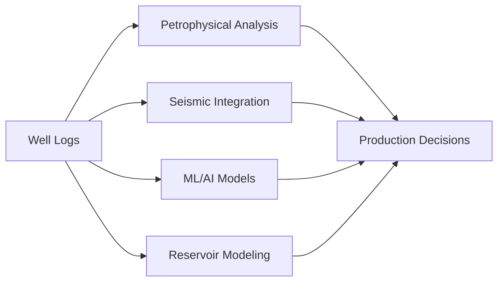

#  Day 1 – Working with Real Well Log Data (LAS Files)

<div align="center">


**Master the fundamentals of subsurface data analysis through real industry well logs**

[🎯 Objectives](#-objective-of-day-1) • [🛢️ Why LAS?](#️-why-las-files-matter-in-oil--gas) • [📘 Structure](#-what-is-a-las-file) • [🧰 Tools](#-tools-used-today) • [💡 Learnings](#-key-learnings-from-day-1)

</div>

---

## 🎯 Objective of Day 1

### **Mission Statement**
The goal of Day 1 is to get comfortable with **real industry well log data** and understand how Python interacts with it.

### **Learning Outcomes** ✅

By the end of today, you will master:

| Skill | Description | Priority |
|-------|-------------|----------|
| 📄 **LAS File Understanding** | Comprehend the Log ASCII Standard format structure | 🔴 Critical |
| 🐍 **Python Integration** | Read and parse LAS files programmatically | 🔴 Critical |
| 🔄 **Data Transformation** | Convert well logs into workable data structures | 🟡 Important |
| ✅ **Quality Control** | Perform systematic data validation checks | 🟡 Important |
| 🧪 **Physical Interpretation** | Understand the geological meaning of each log | 🟢 Essential |

> **Focus Philosophy:** This day emphasizes **data familiarity**, not advanced analytics. Build the foundation before the framework.

---

## 🛢️ Why LAS Files Matter in Oil & Gas

### **Industry Significance** 🌍

In the oil & gas industry, **well logs are the most fundamental subsurface data**. Almost every interpretation workflow starts from well logs.



### **LAS File Characteristics** 📋

| Feature | Description |
|---------|-------------|
| 🏆 **Industry Standard** | Universal format across the petroleum sector |
| 🖥️ **Software Compatible** | Petrel, Techlog, DecisionSpace, Geolog |
| 🤝 **Universally Shared** | Standard exchange format between operators & service companies |
| 📊 **Data Rich** | Contains metadata + measurements + context |

### **Critical Dependencies** ⚠️

**Without LAS file proficiency, you cannot:**

- ❌ Perform petrophysical analysis
- ❌ Train ML models on subsurface data
- ❌ Tie well data with seismic
- ❌ Work effectively as a subsurface analyst
- ❌ Contribute to reservoir characterization
- ❌ Participate in exploration workflows

> **Industry Reality:** LAS files are the *lingua franca* of well data. Master them or remain on the sidelines.

---

## 📘 What is a LAS File?

### **Definition** 📖

A LAS file is a **text-based file format** that contains both **metadata** and **numerical well log data**.

```
┌─────────────────────────────────────┐
│         LAS FILE STRUCTURE          │
├─────────────────────────────────────┤
│  ~Version Information               │
│  ~Well Information        ← Context │
│  ~Curve Information       ← Metadata│
│  ~Parameter Information             │
│  ~ASCII Data              ← Numbers │
└─────────────────────────────────────┘
```

### **Detailed Section Breakdown** 🔍

---

#### 1️⃣ **Well Information Section** `~Well`

**Purpose:** Provides contextual metadata about the well

**Contents:**
- 📍 Well name & unique identifier
- 🌐 Geographic location (lat/lon or X/Y coordinates)
- 📏 Elevation (KB, GL, or MSL reference)
- 🎯 Depth reference system
- 📊 Start and stop depths (measured or true vertical)
- 📅 Date logged
- 🏢 Company & field information

**Key Insight:** This section provides **context**, not measurements. It answers "WHERE and WHAT?" before "HOW MUCH?"

---

#### 2️⃣ **Curve Information Section** `~Curve`

**Purpose:** Defines what each data column represents

**Contains:**
- 🏷️ **Log mnemonic** (e.g., GR, RHOB, NPHI, DT, RT)
- 📐 **Units** (API, g/cc, v/v, µs/ft, ohm.m)
- 📝 **Description** of each curve's physical meaning
- 🔢 **API codes** (standardized curve identifiers)

**Example Structure:**
```
GR    .API     45 310 01 00 : Gamma Ray
RHOB  .G/C3    45 350 02 00 : Bulk Density
NPHI  .V/V     42 890 00 00 : Neutron Porosity
```

**Key Insight:** This section tells you **what each column represents physically**. Without this, data is meaningless numbers.

---

#### 3️⃣ **ASCII Data Section** `~ASCII`

**Purpose:** The actual numerical measurements

**Structure:**
```
DEPTH    GR      RHOB    NPHI    DT      RT
1500.0   85.32   2.45    0.18    95.2    15.3
1500.5   82.15   2.47    0.16    93.8    16.7
1501.0   78.94   2.48    0.15    92.5    18.2
```

**Characteristics:**
- ✅ Depth as first column (index)
- ✅ Regular or irregular sampling intervals
- ✅ Null values represented (typically -999.25 or -999)
- ✅ Tab or space-delimited format

**Key Insight:** This is the **actual numerical data** used for analysis. Everything else supports interpreting these numbers correctly.

---

## 🧰 Tools Used Today

### **Technology Stack** 💻

```python
# Core Data Science Ecosystem for Well Log Analysis

import lasio      # LAS file I/O operations
import pandas     # Tabular data manipulation
import numpy      # Numerical computations
import matplotlib # Visualization (upcoming)
```

| Library | Purpose | Why It Matters |
|---------|---------|----------------|
| **`lasio`** | LAS file parsing | Industry-specific format handler |
| **`pandas`** | DataFrame operations | Tabular data manipulation & analysis |
| **`numpy`** | Numerical arrays | Efficient mathematical operations |
| **Python 3.8+** | Programming language | Flexibility & reproducibility |

### **Workflow Architecture** 🔄

```
┌──────────────┐
│  LAS File    │
│  (.las)      │
└──────┬───────┘
       │
       ↓ lasio.read()
┌──────────────┐
│ lasio.LASFile│
│   Object     │
└──────┬───────┘
       │
       ↓ .df() method
┌──────────────┐
│   Pandas     │
│  DataFrame   │
└──────┬───────┘
       │
       ↓ Analysis
┌──────────────┐
│ Insights &   │
│  QC Results  │
└──────────────┘
```

**Key Advantage:** The LAS file is converted into a **Pandas DataFrame**, which provides:
- ✅ Familiar tabular structure
- ✅ Powerful data manipulation methods
- ✅ Easy integration with ML libraries
- ✅ Efficient memory management

---

## 🧠 Common Well Logs Studied

### **Fundamental Log Suite** 📊

| Log | Full Name | Unit | Physical Measurement | Geological Use | Typical Range |
|----|-----------|------|---------------------|----------------|---------------|
| **GR** | Gamma Ray | API | Natural radioactivity | Shale vs sand discrimination | 0-150+ API |
| **RHOB** | Bulk Density | g/cc | Formation density | Porosity & lithology identification | 1.95-2.95 g/cc |
| **NPHI** | Neutron Porosity | v/v or % | Hydrogen content | Porosity & gas detection | 0-0.45 (45%) |
| **DT** | Sonic (Delta-T) | µs/ft | Acoustic travel time | Velocity & porosity estimation | 40-140 µs/ft |
| **RT** | True Resistivity | ohm.m | Electrical resistance | Fluid saturation (hydrocarbon vs water) | 0.1-1000+ ohm.m |

### **Physical Principles Behind Each Log** 🔬

#### 🟢 **Gamma Ray (GR)**
- **Measures:** Natural radioactivity from K, U, Th
- **Response:** High in shales (clay minerals), low in clean sands
- **Use Case:** Primary lithology indicator

#### 🔵 **Bulk Density (RHOB)**
- **Measures:** Electron density → bulk density
- **Response:** Inversely related to porosity
- **Use Case:** Porosity calculation, lithology identification

#### 🟣 **Neutron Porosity (NPHI)**
- **Measures:** Hydrogen index (H atoms)
- **Response:** High in water-filled pores, anomalously low in gas
- **Use Case:** Porosity estimation, gas detection (crossover with density)

#### 🟡 **Sonic (DT)**
- **Measures:** P-wave travel time through formation
- **Response:** Slower in porous formations
- **Use Case:** Porosity, mechanical properties, seismic correlation

#### 🔴 **Resistivity (RT)**
- **Measures:** Electrical resistivity of formation
- **Response:** High in hydrocarbons (insulators), low in brine (conductive)
- **Use Case:** Water saturation calculation (Archie's equation)

> **Critical Understanding:** Understanding the **physics behind each log** is more important than just plotting them. Know WHY the curve moves, not just WHERE it moves.

---

## 🔍 Data Quality Checks (QC)

### **QC Philosophy** 🎯

> **Golden Rule:** Before any interpretation, QC is **mandatory**.

**Why QC Matters:**
```
Bad Data → Wrong Interpretation → Poor Decisions → Lost Revenue
Quality Data → Accurate Analysis → Smart Decisions → Value Creation
```

### **Standard QC Workflow** ✅

#### **1. Missing Values Detection** ❓

**Check for:**
- Null indicators (-999, -999.25, NaN)
- Gaps in logging runs
- Tool failures

**Python Implementation:**
```python
missing_count = df.isnull().sum()
missing_percent = (missing_count / len(df)) * 100
```

---

#### **2. Depth Indexing Validation** 📏

**Verify:**
- ✅ Monotonically increasing depth
- ✅ Correct sampling interval
- ✅ No duplicate depth values
- ✅ Depth units consistency

**Common Issues:**
- Reversed depth (decreasing instead of increasing)
- Irregular sampling without explanation
- Depth unit confusion (meters vs feet)

---

#### **3. Spike Detection** ⚡

**Identify:**
- Unrealistic sudden jumps
- Tool measurement errors
- Environmental effects (washouts, cave-ins)

**Methods:**
- Statistical outlier detection (3-sigma rule)
- Gradient analysis (rate of change)
- Domain knowledge (physical limits)

---

#### **4. Unit Consistency** 📐

**Ensure:**
- All curves use declared units
- No mixing of metric/imperial
- API standard units where applicable

**Example Issues:**
- Density in g/cc vs kg/m³
- Depth in meters vs feet
- Resistivity in ohm.m vs different scales

---

### **QC Best Practices** 🏆

```python
# Comprehensive QC Checklist
✅ Load file and check metadata
✅ Verify curve mnemonics and units
✅ Check depth range and sampling
✅ Identify missing values
✅ Detect statistical outliers
✅ Validate physical ranges
✅ Cross-check related logs
✅ Document all issues found
```

### **Critical Insight** 💡

> **"Dirty data leads to wrong interpretation, no matter how good the model is."**

**Remember:**
- 🎯 QC is not optional—it's foundational
- 🧹 Cleaning data takes 60-80% of analysis time
- 📊 Well-QC'd data makes everything downstream easier
- 🔬 Trust your data before you trust your results

---

## 📊 Initial Observations

### **Real-World Realities** 🌐

After working with actual industry LAS files, several truths become apparent:

#### **1. Imperfection is Normal** ⚠️
- Real well log data is **never perfect**
- Field conditions create measurement challenges
- Tool malfunctions are common
- Environmental effects are unavoidable

#### **2. Missing Data is Standard** ❌
- Missing values are **common and expected**
- Causes: tool failures, bad hole conditions, logging speed issues
- Must be handled systematically, not ignored

#### **3. Scale Variations are Significant** 📏
- Logs have **different ranges and units**
- GR: 0-150 API
- RHOB: 1.95-2.95 g/cc  
- NPHI: 0-0.45 v/v
- Cannot compare directly without normalization

#### **4. Depth is Fundamental** 🎯
- Depth should always be treated carefully
- **Increases downward** (geological convention)
- Acts as the primary index for all measurements
- Depth errors corrupt entire dataset

### **Mental Model Development** 🧠

```
Industry Data ≠ Textbook Data

Textbook:           Reality:
□ Clean             □ Noisy
□ Complete          □ Gaps
□ Consistent        □ Variable quality
□ Simple            □ Complex

Adapt expectations accordingly!
```

---

## 💡 Key Learnings from Day 1

### **Fundamental Insights** 🎓

#### **1. LAS File Architecture** 🏗️
- LAS files are **simple text files** but extremely powerful
- Text-based format = human-readable + machine-parsable
- Standardization enables industry-wide compatibility
- Structure separates metadata from data intelligently

#### **2. Metadata Primacy** 📋
- **Metadata is as important as data**
- Context transforms numbers into information
- Units, descriptions, and well info are critical
- Never analyze data without understanding its metadata

#### **3. Python as Liberation Tool** 🔓
- Python makes subsurface data **transparent and flexible**
- No black-box software—full control over every step
- Reproducible workflows (run same code = same result)
- Integration with modern data science ecosystem

#### **4. Foundation-First Philosophy** 🏛️
- **Data understanding comes BEFORE ML or advanced analysis**
- Cannot build sophisticated models on weak foundations
- Time spent on fundamentals pays exponential dividends
- Resist the urge to skip to "exciting" algorithms

### **Professional Mindset** 💼

```
Beginner Thinking:
"Let me build an ML model quickly"
         ↓
      FAILURE
         ↓
"Why doesn't it work?"

Professional Thinking:
"Let me understand the data deeply"
         ↓
   FOUNDATION
         ↓
"Now I can build something reliable"
```

### **Competency Progression** 📈

```
Day 1: Data Literacy
   ↓
Week 1: Data Manipulation  
   ↓
Month 1: Basic Analysis
   ↓
Quarter 1: Advanced Workflows
   ↓
Year 1: Expert Practitioner
```

---

## 📌 Conclusion

### **Day 1 Achievement Unlocked** 🏆

Day 1 has successfully laid the **foundation for subsurface data analysis**.

**Strategic Approach:**
Instead of jumping into algorithms, focus was placed on:

```
✅ Understanding the data
   └─> Its structure, meaning, and context

✅ Respecting industry workflows  
   └─> Why standards exist and how they're used

✅ Building strong fundamentals
   └─> Concepts that will support all future work
```

### **Long-Term Impact** 🎯

This foundational approach will make future workflows **more reliable and meaningful**:

| Workflow Type | Benefit of Strong Foundation |
|---------------|----------------------------|
| 🧪 Petrophysical Analysis | Accurate property calculations |
| 🤖 Machine Learning | Quality training data |
| 🌊 Geophysical Integration | Proper well-to-seismic ties |
| 📊 Reservoir Modeling | Trustworthy input parameters |
| 💼 Decision Support | Confidence in recommendations |

### **Philosophical Takeaway** 🌟

> **"The quality of your analysis can never exceed the quality of your understanding of the data."**

**Investment Made Today:**
- ⏰ Time learning LAS structure
- 🧠 Effort understanding log physics  
- 💻 Practice with Python tools
- 🔍 Discipline in QC processes

**Returns Tomorrow:**
- 🚀 Faster analysis workflows
- ✅ More accurate interpretations
- 💡 Better problem-solving ability
- 🏆 Professional credibility

---

## 🚀 Next Steps

### **📅 Day 2 Preview: Well Log Visualization with Depth & QC Highlighting**

**Coming Soon:**
- 📊 Professional well log plotting techniques
- 🎨 Multi-track log displays (industry standard)
- 🔴 QC flag visualization and highlighting
- 🖼️ Matplotlib and Plotly for subsurface graphics
- 📐 Depth scale management and formatting
- 🎯 Creating publication-ready figures

### **Preparation for Day 2:**
- [ ] Review today's LAS file structure
- [ ] Practice loading different LAS files
- [ ] Familiarize with matplotlib basics
- [ ] Think about what makes a "good" log plot

---

<div align="center">

### **Progress Tracker** 📊

```
Day 1: ████████████████████░░ 80% Complete
       [Foundation] ✅ MASTERED

Next Milestone: Visualization Skills
```

---

**🌟 Keep Building. Keep Learning. Keep Growing. 🌟**

[]()
[]()
[]()

**📧 Questions? Feedback? Let's discuss!**

</div>

---

### **Document Metadata** 📄

```yaml
Title: Day 1 - Working with Real Well Log Data
Version: 2.0 (Enhanced)
Date: 2025-12-20
Focus: LAS Files & Data Fundamentals
Difficulty: Beginner to Intermediate
Time Required: 4-6 hours
Prerequisites: Basic Python knowledge
```

---

**© 2025 Well Log Analysis Series | Empowering Subsurface Data Scientists**
