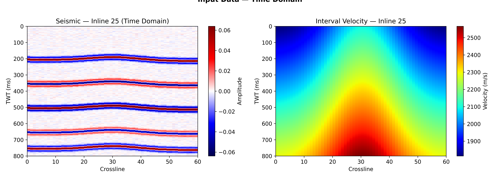

<div align="center">

<p align="center">
  
</p>
<p align="center">
  
</p>

# 🛢️ 100 Days of Python for Oil & Gas Subsurface Analytics

### *A structured, hands-on journey from geoscience fundamentals to production-ready subsurface analytics*

[](https://www.python.org/)
[](https://jupyter.org/)
[](LICENSE)
[](https://github.com/Ashraf-ISM/100-Days-of-Python-for-Oil-Gas-Subsurface-Analytics/actions/workflows/ci.yml)
[](docs/ROADMAP.md)
[](https://github.com/Ashraf-ISM/100-Days-of-Python-for-Oil-Gas-Subsurface-Analytics/stargazers)
[](https://github.com/Ashraf-ISM/100-Days-of-Python-for-Oil-Gas-Subsurface-Analytics/network)

[🚀 Quick Start](#-quick-start) · [📊 Roadmap](#-roadmap) · [📁 Structure](#-repository-structure) · [🛠️ Tech Stack](#️-technology-stack) · [🤝 Contributing](#-contributing)

</div>

---

## 📖 Table of Contents

- [About](#-about)
- [What You'll Build](#-what-youll-build)
- [Roadmap](#-roadmap)
- [Repository Structure](#-repository-structure)
- [Technology Stack](#️-technology-stack)
- [Quick Start](#-quick-start)
- [Gallery](#️-gallery)
- [Daily Workflow](#-daily-workflow)
- [Prerequisites](#-prerequisites)
- [Learning Resources](#-learning-resources)
- [Contributing](#-contributing)
- [License](#-license)

---

## 🎯 About

This is a **100-day, project-driven curriculum** for geoscientists and petroleum engineers who want to build real Python skills for subsurface analytics. Every day covers a concrete topic — from reading LAS files on Day 1 to deploying a machine-learning-powered reservoir characterisation platform on Day 100.

The course is deliberately **industry-focused**: datasets come from real subsurface workflows, code follows production standards, and deliverables are portfolio-ready.

> **Who is this for?** Geophysicists, petrophysicists, reservoir engineers, and geoscience students who have basic Python familiarity and want to apply it to O&G workflows.

---

## 🏗️ What You'll Build

| Phase | Days | Output |
|-------|------|--------|
| **Data Engineering** | 1 – 20 | Multi-well ingestion pipeline, automated QC system |
| **Petrophysics** | 21 – 40 | Full petrophysical interpreter, rock-typing module |
| **Seismic Analytics** | 41 – 60 | SEGY reader, attribute engine, well-tie automation |
| **Machine Learning** | 61 – 85 | Electrofacies classifier, production forecaster, seismic inversion |
| **Capstone** | 86 – 100 | Integrated, deployed subsurface analytics platform |

---

## 📊 Roadmap

### Phase I — Subsurface Data Engineering *(Days 1–20)*

| Days | Topic | Key Deliverable |
|------|-------|----------------|
| 1–5  | Well log ingestion (LAS/DLIS) | `well_log_ingestion_pipeline.py` |
| 6–10 | Production data analytics | Decline-curve analyser notebook |
| 11–15 | Data QC & anomaly detection | Automated QC dashboard |
| 16–20 | Geological zonation | Formation-top handler & cross-section tool |

### Phase II — Petrophysics & Rock Physics *(Days 21–40)*

| Days | Topic | Key Deliverable |
|------|-------|----------------|
| 21–25 | Core petrophysical calculations | `petrophysics_engine.py` (Vsh, PHIE, Sw, Perm) |
| 26–30 | Cross-plots & rock typing | Electrofacies clustering module |
| 31–35 | Saturation height & fluid contacts | OOIP/OGIP calculator |
| 36–40 | Rock physics modelling | Gassmann fluid-substitution toolkit |

### Phase III — Seismic Data Analytics *(Days 41–60)*

| Days | Topic | Key Deliverable |
|------|-------|----------------|
| 41–45 | SEGY I/O & header parsing | `segy_data_explorer.py` |
| 46–50 | Seismic attribute computation | Multi-attribute engine (RMS, coherence, curvature) |
| 51–55 | Time-depth conversion | Velocity model builder |
| 56–60 | Seismic-well tie | Automated well-tie & synthetic seismogram tool |

### Phase IV — Machine Learning for Subsurface *(Days 61–85)*

| Days | Topic | Key Deliverable |
|------|-------|----------------|
| 61–65 | Electrofacies classification | Random Forest / GMM classifier |
| 66–70 | Reservoir property prediction | XGBoost porosity/permeability predictor |
| 71–75 | Production forecasting | LSTM + Prophet time-series pipeline |
| 76–80 | Seismic-to-property inversion | 3D property cube from attributes |
| 81–85 | Explainability & uncertainty | SHAP dashboard, Monte Carlo uncertainty |

### Phase V — Industry-Grade Capstone *(Days 86–100)*

Deploy one of three capstone options:

- **Option A** — Integrated subsurface analytics web platform (FastAPI + Streamlit)
- **Option B** — Distributable Python toolkit published to PyPI
- **Option C** — ML-driven reservoir characterisation pipeline with a benchmarking dataset

---

## 📁 Repository Structure

```
100-Days-of-Python-for-Oil-Gas-Subsurface-Analytics/
│
├── 📂 data/
│   └── 📂 raw/                    # Raw well-log, SEGY, and production data
│
├── 📂 notebooks/
│   ├── �� day-01/                 # LAS file basics & PyVista intro
│   ├── 📂 day-02/                 # SEGY read/write workflows
│   ├── 📂 day-03/                 # Seismic I/O with seisio
│   ├── 📂 day-04-09bruges/        # Bruges geophysics library deep-dive
│   ├── 📂 day-10-multi-attribute/ # Multi-attribute seismic analysis
│   ├── 📂 day-11-DEEP_LEARNING/   # Deep learning foundations
│   └── 📂 day-13-20_Seismic-Attributes/  # Full attribute computation suite
│
├── 📂 src/
│   └── 📂 seismic/                # Reusable seismic processing modules
│
├── 📂 outputs/
│   ├── 📂 figures/                # Saved plots and visualisations
│   └── 📂 reports/                # HTML/PDF report outputs
│
├── 📂 assets/
│   ├── 📄 banner.svg
│   ├── 📄 logo.svg
│   └── 📂 badges/
│
├── 📂 scripts/                    # Utility and automation scripts
│
├── 📂 docs/
│   ├── 📄 GETTING_STARTED.md
│   ├── 📄 FAQ.md
│   ├── 📄 ROADMAP.md
│   ├── 📄 CONTRIBUTING.md
│   └── 📄 CODE_OF_CONDUCT.md
│
├── 📂 tests/
│   └── 📄 test_structure.py
│
├── 📄 requirements.txt
├── 📄 environment.yml             # Conda environment (Python 3.11)
├── 📄 pyproject.toml
├── 📄 Makefile
├── 📄 CHANGELOG.md
├── 📄 CITATION.cff
├── 📄 LICENSE
└── 📄 README.md
```

---

## 🛠️ Technology Stack

### Core Scientific Computing
| Library | Purpose |
|---------|---------|
| `numpy` | Array computing |
| `pandas` | Tabular data & time series |
| `scipy` | Scientific algorithms |
| `matplotlib` / `seaborn` | Static visualisation |

### Subsurface Formats
| Library | Purpose |
|---------|---------|
| `lasio` | LAS well-log files |
| `segyio` / `seisio` | SEG-Y seismic data |
| `bruges` | Geophysical equations & rock physics |
| `pyvista` | 3-D mesh & volume visualisation |

### Machine Learning
| Library | Purpose |
|---------|---------|
| `scikit-learn` | Classical ML (clustering, classification, regression) |
| `xgboost` / `lightgbm` | Gradient boosting |
| `tensorflow` / `keras` | Deep learning |
| `shap` | Model explainability |

### Visualisation & Dashboards
| Library | Purpose |
|---------|---------|
| `plotly` | Interactive charts |
| `dash` / `streamlit` | Web dashboards |
| `panel` / `holoviews` | Data exploration apps |

---

## 🚀 Quick Start

### Option 1 — Conda (recommended)

```bash
git clone https://github.com/Ashraf-ISM/100-Days-of-Python-for-Oil-Gas-Subsurface-Analytics.git
cd 100-Days-of-Python-for-Oil-Gas-Subsurface-Analytics

conda env create -f environment.yml
conda activate geo

jupyter lab
```

### Option 2 — pip + virtualenv

```bash
git clone https://github.com/Ashraf-ISM/100-Days-of-Python-for-Oil-Gas-Subsurface-Analytics.git
cd 100-Days-of-Python-for-Oil-Gas-Subsurface-Analytics

python -m venv venv
source venv/bin/activate        # Windows: venv\Scripts\activate
pip install -r requirements.txt

jupyter lab
```

### Verify the install

```bash
python -c "import lasio, segyio, bruges, numpy; print('✅ Core packages installed')"
```

### Start Day 1

```bash
cd notebooks/day-01
jupyter notebook day1.ipynb
```

After completing each day, track your progress:

```bash
git add .
git commit -m "Day 01: LAS basics complete ✅"
git push origin main
```

---

## 🖼️ Gallery

<div align="center">




</div>

---

## 🗓️ Daily Workflow

Each day is designed for roughly **2–3 hours** of focused work:

```
① Review yesterday's notebook and notes                    ~15 min
② Work through today's notebook (code-along)              ~60 min
③ Complete the practice exercises                         ~45 min
④ Commit code with a descriptive message                  ~10 min
⑤ Document key learnings in the day's README or notes    ~10 min
```

---

## 📋 Prerequisites

**Required**
- Python basics (variables, loops, functions, list comprehensions)
- NumPy arrays and pandas DataFrames
- Basic command-line and Git usage
- Background in geophysics, petrophysics, or petroleum engineering

**Helpful but not essential**
- Machine learning awareness
- Jupyter notebook experience
- Basic statistics and linear algebra

**Not sure if you're ready?** Run the snippet below — if you can follow the logic, you're good to go:

```python
import numpy as np, pandas as pd

depth = np.arange(1000, 2000, 0.5)
gr    = np.random.normal(75, 25, len(depth))
df    = pd.DataFrame({'DEPTH': depth, 'GR': gr})
print(df[(df['GR'] > 0) & (df['GR'] < 150)].describe())
```

---

## 📚 Learning Resources

### Essential Books
| Title | Author | Focus |
|-------|--------|-------|
| *Python for Data Analysis* | Wes McKinney | pandas & NumPy |
| *Hands-On Machine Learning* | Aurélien Géron | Scikit-learn, TensorFlow |
| *Petrophysics* | Djebbar & Donaldson | Core petrophysical theory |
| *Seismic Data Analysis* | Öz Yilmaz | Seismic processing theory |

### Open Datasets
| Dataset | Description | Source |
|---------|-------------|--------|
| **Volve Field** | Complete North Sea field (logs, seismic, production) | [Equinor Open Data](https://www.equinor.com/energy/volve-data-sharing) |
| **Poseidon NW Australia** | Well logs & seismic | [Geoscience Australia](https://www.ga.gov.au/) |
| **FORCE 2020** | Lithology prediction ML competition | [FORCE](https://github.com/bolgebrygg/Force-2020-Machine-Learning-competition) |
| **KGS Open Data** | Public well database | [Kansas Geological Survey](https://www.kgs.ku.edu/) |
| **SEG Open Data** | Curated seismic datasets | [SEG Wiki](https://wiki.seg.org/wiki/Open_data) |

### Community
- [**Software Underground**](https://softwareunderground.org/) — Slack community for geoscience + tech
- [**Agile Geoscience Blog**](https://agilescientific.com/blog) — Python geoscience articles
- [**SEG Open Source**](https://github.com/seg) — Society of Exploration Geophysicists repos

---

## 🤝 Contributing

Contributions are welcome! Bug fixes, new notebooks, improved documentation, and additional exercises are all appreciated.

```bash
# 1. Fork the repository
# 2. Clone your fork
git clone https://github.com/YOUR_USERNAME/100-Days-of-Python-for-Oil-Gas-Subsurface-Analytics.git

# 3. Create a feature branch
git checkout -b feature/buckles-plot-module

# 4. Commit your changes
git commit -m "Add Buckles plot to rock typing module"

# 5. Push and open a Pull Request
git push origin feature/buckles-plot-module
```

See [docs/CONTRIBUTING.md](docs/CONTRIBUTING.md) for the full contribution guide and [docs/CODE_OF_CONDUCT.md](docs/CODE_OF_CONDUCT.md) for community standards.

---

## 🔐 Security

Please review [SECURITY.md](SECURITY.md) before reporting vulnerabilities.

---

## 📄 License

This project is licensed under the **MIT License** — see [LICENSE](LICENSE) for details. Free for personal and commercial use; attribution appreciated.

---

## 🙏 Acknowledgements

- [**Agile Geoscience**](https://agilescientific.com/) — inspiration and open-source geoscience tools
- [**Software Underground**](https://softwareunderground.org/) — community support
- [**SEG**](https://seg.org/) — technical resources and open datasets
- Maintainers of `lasio`, `segyio`, and `bruges` — the backbone of this curriculum

---

<div align="center">

[](https://github.com/Ashraf-ISM)
[](https://github.com/Ashraf-ISM/100-Days-of-Python-for-Oil-Gas-Subsurface-Analytics/discussions)
[](https://github.com/Ashraf-ISM/100-Days-of-Python-for-Oil-Gas-Subsurface-Analytics/issues)

<br>

**⭐ Star this repo if it helps your learning journey!**

<br>

<sub>Built with ❤️ for the subsurface analytics community</sub>

</div>
