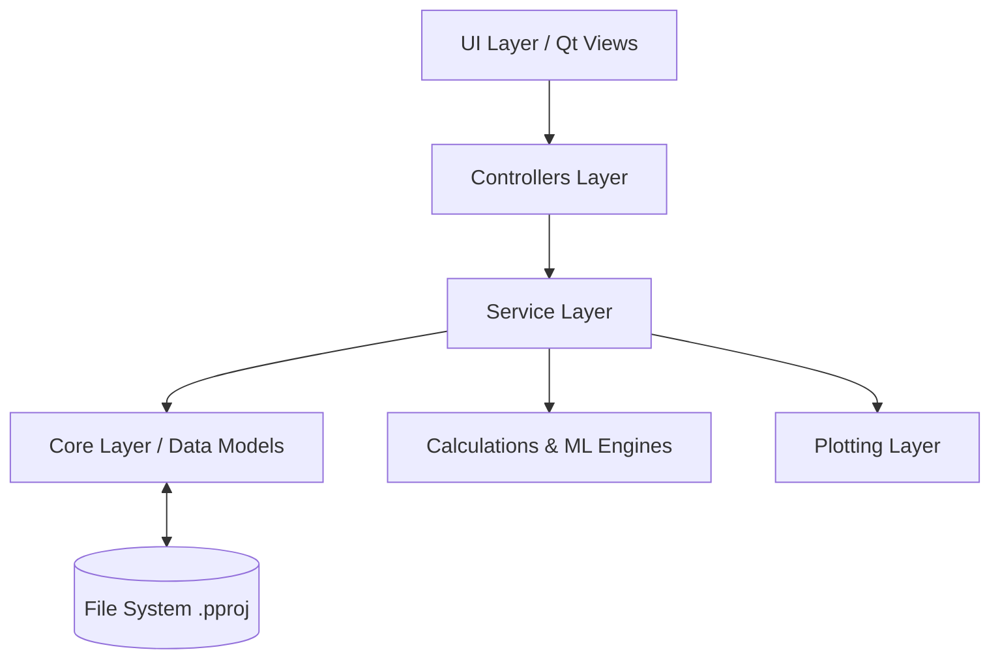

# PetroARX - Comprehensive Project Knowledge Base (BRAIN.md)

## Table of Contents
1. [Instructions for Future AI Agents](#instructions-for-future-ai-agents)
2. [Project Overview](#project-overview)
3. [Technology Stack](#technology-stack)
4. [System Architecture](#system-architecture)
5. [Folder Documentation](#folder-documentation)
6. [Important Files](#important-files)
7. [UI & Component Documentation](#ui--component-documentation)
8. [Backend & Service Documentation](#backend--service-documentation)
9. [Database & Persistence](#database--persistence)
10. [Business Logic & Workflows](#business-logic--workflows)
11. [Dependency Graph](#dependency-graph)
12. [Application Flow](#application-flow)
13. [Coding Standards](#coding-standards)
14. [Performance Notes](#performance-notes)
15. [Security Notes](#security-notes)
16. [Common Tasks](#common-tasks)
17. [File Modification Frequency](#file-modification-frequency)
18. [Known Technical Debt](#known-technical-debt)
19. [Project Roadmap](#project-roadmap)
20. [Project Memory](#project-memory)

---

## Instructions for Future AI Agents
> [!IMPORTANT]
> **READ THIS FIRST BEFORE EXPLORING THE REPOSITORY.**
> 
> - **Always read this `BRAIN.md` first.**
> - **Never scan the entire repository** unless absolutely necessary.
> - **Only inspect files** directly relevant to your requested task.
> - **Preserve architecture:** Respect the UI (View) -> Controller -> Service -> Core hierarchy. Do not bypass layers.
> - **Reuse existing utilities:** Always check `core/` and `services/` for existing solutions before implementing new ones.
> - **Reuse existing components:** Leverage PyQt5 templates and `.ui` files.
> - **Never duplicate logic:** Centralize domain logic within `calculations/` or `services/`.
> - **Avoid unnecessary dependencies:** Use the established libraries (pandas, numpy, scikit-learn, PyVista, PyQt5).
> - **Follow project conventions:** Strict typing where applicable, descriptive snake_case for methods, CamelCase for classes.
> - **Keep commits minimal** and avoid breaking changes.
> - **Maintain backward compatibility** with `.pproj` JSON serializations.
> - **Update this document** whenever architecture or critical paths change.
> - **Explain planned modifications** to the user before editing core files.
> - If required context is missing, **ask the user before exploring more files**.

---

## Project Overview
- **Project Name**: PetroARX (formerly PetroVision)
- **Business Domain**: Geosciences, Petrophysics, Oil & Gas Subsurface Analytics, and Well Log Interpretation.
- **Target Users**: Petrophysicists, Geologists, Reservoir Engineers, and Data Scientists in the energy sector.
- **Problems Solved**: Provides an integrated, desktop-based GUI to import well logs (LAS/CSV), quality-control data, run deterministic petrophysical models (Vshale, Porosity, Saturation), perform ML-driven missing log prediction, analyze geomechanics/pore pressure, classify facies, and visualize wells in 2D cross-plots and 3D trajectories.
- **Major Workflows**:
  1. Data Import (LAS, CSV) & QC.
  2. Multi-well Correlation.
  3. Formation Evaluation (Deterministic Petrophysics).
  4. Advanced Analytics (ML QC, Facies Classification).
  5. 2D/3D Visualization & Reporting.
  6. Project persistence (Save/Load `.pproj` JSON files).

---

## Technology Stack
- **Programming Language**: Python 3.10+
- **UI Framework**: PyQt5 / PySide6 (Primary entry point relies on PyQt5/Qt Designer `.ui` files).
- **Data Processing**: Pandas, NumPy, SciPy.
- **Geosciences / Domain Libs**: `lasio` (LAS file I/O), `welly`, `segyio`, `dlisio`.
- **Machine Learning / AI**: Scikit-Learn, TensorFlow/Keras, CatBoost, XGBoost, Imbalanced-Learn.
- **Visualization (2D)**: Matplotlib, Plotly, Seaborn, Altair.
- **Visualization (3D)**: PyVista, PyVistaQt (VTK-based 3D well trajectory rendering).
- **Mapping**: Cartopy, GeoPandas, Shapely.
- **Serialization**: Standard Python `json` (No external database, uses file-based JSON storage).
- **Build / Packaging**: PyInstaller.

---

## System Architecture
PetroARX follows a strict **Model-View-Controller-Service (MVCS)** architectural pattern.



- **UI Layer (`app/`, `ui/`)**: Defines the visual elements via Qt Designer XML files (`.ui`) and wrapper Python classes.
- **Controller Layer (`controllers/`)**: Connects UI events (buttons, menus) to Service layer actions.
- **Service Layer (`services/`)**: Contains the business logic state machine. It manages active wells, triggers calculations, and maintains "modified" states.
- **Core Layer (`core/`)**: Pure data models (`Well`), project serialization/deserialization logic, and application state.
- **Domain Modules**: Isolated logic for specific tasks (`calculations/`, `geomechanics/`, `ml_qc/`, `qc/`, `Facies_classifications/`).

---

## Folder Documentation

| Directory | Responsibility | Guidelines |
|-----------|----------------|------------|
| `app/` | Application entry points (`petrovision_main.py`). | Only app initialization and window setup. Do not put business logic here. |
| `core/` | Fundamental data models (`data_model.py`) and project persistence (`project_manager.py`). | Must remain independent of UI. Should have zero PyQt imports if possible. |
| `services/` | Business logic orchestrators (`data_service.py`, `interpretation_service.py`). | This is the connective tissue. Keep methods focused on state mutation and calculation orchestration. |
| `controllers/` | Bridges UI signals to Services. | Do not put math/logic here. Only signal connections and UI state toggling. |
| `ui/` | Qt Designer `.ui` files and complex UI panel wrappers. | Store all XML UI definitions here. Python files should only be for complex dynamic UI generation. |
| `data/` | Data ingestors, parsers (`well_data_loader.py`), and downloaders. | Keep data format specifics (LAS, CSV) contained here. |
| `calculations/` | Pure petrophysical math algorithms (Vsh, Phi, Sw). | No UI logic. Should accept arrays/Series and return arrays/Series. |
| `qc/` | Rule-based quality control engines. | Defines physical rules and spike detection. |
| `ml_qc/` | Machine learning-based anomaly detection. | Contains models to predict synthetic logs and flag anomalies. |
| `plotting/` | Specialized Matplotlib/PyVista charting wrappers. | Reusable plot generators. |
| `Well_3d/` | 3D trajectory visualization workspace. | PyVista integrations. |
| `geomechanics/` | Pore pressure and stress analytics. | Domain-specific calculations. |
| `well_correlation/` | Multi-well cross-section tools. | Handles stratigraphic alignment visualizations. |
| `projects/` & `outputs/` | User output targets. | Directories for saved projects and exported plots. |

---

## Important Files

- `app/petrovision_main.py`: **Entry Point.** Bootstraps the application, loads `mainwindow.ui`, injects the `MainController`, and manages the top-level tab embedding. **Risk:** High. Changes here can break the entire UI layout.
- `controllers/main_controller.py`: **The Brain of the UI.** Wires every button on the dashboard to a specific `Service` method. 
- `services/project_service.py`: **State Manager.** Manages the `ProjectData` lifecycle (New, Load, Save, Save As) and tracks if the project has unsaved modifications.
- `services/data_service.py`: **Data Manager.** Holds the `_wells` dictionary (the in-memory database of all loaded well data).
- `core/data_model.py`: **The Schema.** Defines the `Well` dataclass (name, header, log_info, pandas DataFrame).
- `core/project_manager.py`: **Disk I/O.** Handles the JSON serialization (DataFrames to dictionaries) and writing `.pproj` files.

---

## UI & Component Documentation
The UI relies heavily on **Qt Designer (`.ui`)** files, which are loaded dynamically using `uic.loadUi()`.
- `mainwindow.ui`: The monolithic main window layout containing the dashboard and static tabs.
- `tab_3d_well_visualization.ui`: Sub-component UI injected dynamically into the 3D Well tab.
- `multiwell_correlation.ui`: Sub-component UI for the correlation tab.
- `facies_classifications.ui`: Standalone window UI for ML facies work.

> [!TIP]
> When adding a new tab, prefer creating a standalone `.ui` file and embedding it dynamically in `petrovision_main.py` using a dedicated method (e.g., `_embed_new_tab()`) rather than bloating `mainwindow.ui`.

---

## Backend & Service Documentation
The "Backend" consists of Python singletons (Services) instantiated by the `MainController`.
- `DataService`: Manages `self._wells = {}`. Methods: `import_data()`, `set_current_well()`.
- `InterpretationService`: Centralizes Formation Evaluation. Orchestrates calls to `calculations/vshale.py`, `calculations/porosity.py`, etc., and appends the results to the active Well's DataFrame.
- `ProjectService`: Manages saving/loading. Projects are marked modified (`mark_modified()`) whenever a Service changes data.

---

## Database & Persistence
**There is no traditional SQL/NoSQL database.**
- **Format**: Custom `.pproj` files, which are strictly formatted JSON files.
- **Structure**:
  ```json
  {
    "name": "Project Name",
    "created": "ISO-8601",
    "modified": "ISO-8601",
    "metadata": { "field": "North Sea" },
    "wells": {
      "Well-1": {
        "name": "Well-1",
        "header": { "DEPTH": 3500 },
        "log_info": { "GR": {"min": 0, "max": 150} },
        "data": [
          {"DEPTH": 1000, "GR": 50},
          {"DEPTH": 1000.5, "GR": 52}
        ]
      }
    }
  }
  ```
- **Lifecycle**: Dataframes are serialized `df.to_dict('records')` on Save, and deserialized `pd.DataFrame.from_records()` on Load.

---

## Business Logic & Workflows

### 1. Data Ingestion
Files (`.las`, `.csv`) are loaded via `well_data_loader.py`. Headers are extracted, and numerical data is converted to a Pandas DataFrame. Missing values are coerced to `np.nan`.

### 2. Deterministic Petrophysics (Formation Evaluation)
Triggered by the UI, handled by `InterpretationService`.
- **Vshale**: Gamma Ray (Linear, Larionov, Steiber, Clavier), SP, or ND crossplot.
- **Porosity**: Density, Neutron, Sonic, or ND-Combination.
- **Saturation**: Archie, Simandoux, Indonesian.
Results are immediately appended to the Well's DataFrame.

### 3. Machine Learning (QC & Facies)
- **ML QC**: Uses pre-trained models (e.g., CatBoost/XGBoost) to predict what a curve (like RHOB) *should* be based on other curves (GR, DT, NPHI). It flags anomalies where actual deviates significantly from predicted.
- **Facies**: Trains classifiers on labeled intervals to predict lithology/facies across unlabelled depths.

---

## Dependency Graph
```
app/petrovision_main.py 
  └── controllers/main_controller.py 
       ├── services/project_service.py 
       │    └── core/project_manager.py
       ├── services/data_service.py 
       │    └── core/data_model.py
       ├── services/interpretation_service.py
       │    └── calculations/ (vshale, porosity, saturation)
       ├── services/qc_service.py
       └── plotting/ (log_availability_radar, etc.)
```

---

## Application Flow
1. **Startup**: `python app/petrovision_main.py`.
2. **Initialization**: `PetroVisionMainWindow` initializes UI. `MainController` initializes all Services.
3. **Project Check**: If a `.pproj` path is passed via CLI, it triggers `ProjectService.load_project_from_path()`.
4. **User Action**: User clicks "Load Well Logs". `MainController` routes signal to `DataService.import_data()`.
5. **State Update**: Data loaded, `ProjectService.mark_modified()` called. Window title appends `*`.
6. **Shutdown**: User closes window. `closeEvent` checks `ProjectService.is_project_modified()`. Prompts "Save, Discard, Cancel".

---

## Coding Standards
- **Naming Conventions**: 
  - Modules & Functions: `snake_case.py`
  - Classes: `PascalCase`
  - Private Methods/Variables: Prefix with underscore (e.g., `_wells`, `_serialize_well_data()`)
  - UI Variables in code: `btnLoadProject`, `comboPoroDepth` (CamelCase with widget type prefix).
- **Formatting**: `black` formatting standards. 
- **Type Usage**: Strict type hinting is highly encouraged (`def compute(df: pd.DataFrame) -> np.ndarray:`).
- **Error Handling**: Use Qt Message Boxes for user-facing errors (`QtWidgets.QMessageBox.critical()`). Never allow background exceptions to crash the GUI.

---

## Performance Notes
> [!TIP]
> **Optimization Opportunities**
> - **Serialization**: `df.to_dict('records')` is extremely slow and memory-intensive for high-resolution logs. Consider switching `.pproj` to use HDF5, Parquet, or binary blobs wrapped in JSON if performance degrades on large projects.
> - **Plotting**: Matplotlib can block the Qt Event Loop. Very large well plots should use decimation/downsampling or PyQtGraph for real-time panning/zooming.
> - **3D Rendering**: PyVista handles large point clouds well, but aggressive decimation is recommended before passing trajectory points to the renderer.

---

## Security Notes
- **Local Desktop App**: Runs locally. No remote authentication, no secrets management required currently.
- **File Parsing**: LAS/CSV parsing uses standard libraries, but malicious crafted files could theoretically cause memory exhaustion.
- **Data Execution**: Ensure that loaded project files (`.pproj`) do not execute arbitrary Python code. Do not use `pickle` or `eval()` for loading data. Rely strictly on JSON.

---

## Common Tasks
- **Run Locally**: 
  ```bash
  cd notebooks/day-25-petrophysics
  python app/petrovision_main.py
  ```
- **Run Tests / Example Script**: 
  ```bash
  python example_project_usage.py
  ```
- **Add a UI Component**: 
  1. Open/Create `.ui` file in Qt Designer. 
  2. Save to `ui/`. 
  3. Load via `uic.loadUi()` in a wrapper class. 
  4. Embed wrapper in `app/petrovision_main.py`.
- **Add a Petrophysical Calculation**: 
  1. Add math logic to `calculations/`. 
  2. Add orchestration to `InterpretationService`. 
  3. Add a button/action in Qt Designer and wire it in `MainController`.

---

## File Modification Frequency
- **Frequently Modified**:
  - `controllers/main_controller.py`: Almost every new feature requires wiring here.
  - `app/petrovision_main.py`: Required when embedding new tabs or windows.
  - `mainwindow.ui`: The primary dashboard requires constant tweaking.
- **Rarely Modified**:
  - `core/data_model.py`: The fundamental `Well` schema should remain highly stable.
  - `calculations/physical_rules.py`: Basic physics algorithms rarely change.

---

## Known Technical Debt
- **UI Bloat**: `mainwindow.ui` is a massive XML file (398KB). Splitting it into smaller, modular `.ui` files is highly recommended.
- **Main App Size**: `petrovision_main.py` is nearly 2,000 lines long. UI setup logic should ideally be abstracted into dedicated UI view classes.
- **JSON Serialization**: Using JSON for pandas DataFrames is computationally expensive for large wells.
- **Blocking Operations**: Large calculations and I/O operations currently run on the main thread, freezing the UI briefly. They should be moved to `QThread` or `QRunnable`.

---

## Project Roadmap
1. **Modularization**: Break down `mainwindow.ui` and `petrovision_main.py`.
2. **Performance Improvements**: Implement multithreading (`QThread`) for ML models, ML QC, and heavy data imports.
3. **Binary Storage**: Migrate `.pproj` data blobs to Parquet or HDF5 for massive speed improvements on load/save.
4. **Undo/Redo Stack**: Implement full `QUndoStack` for all petrophysical calculations to allow reverting mistakes.
5. **Advanced Reporting**: Automated PDF/HTML report generation from the QC and analysis modules.

---

## Project Memory
> [!IMPORTANT]
> **CRITICAL FACTS TO ALWAYS REMEMBER**
> - **Architecture**: Strict MVCS. UI -> Controller -> Service -> Core.
> - **Core Data Model**: Everything revolves around the `Well` dataclass and its internal Pandas DataFrame (`Well.data`).
> - **State Management**: If you alter `Well.data`, you **MUST** call `ProjectService.mark_modified()` or the user's changes will be lost on exit.
> - **Persistence**: `.pproj` files are just JSON. **DO NOT USE PICKLE**.
> - **UI Framework**: PyQt5. Do not write raw UI layout code if a `.ui` file exists. Use Qt Designer.
> - **Thread Safety**: Do not block the Qt Event Loop. Use `QTimer` for deferred loading. 
> - **Do-not-touch files**: `core/data_model.py` and `core/project_manager.py` schema unless you are explicitly writing a database migration. Changes here break all previously saved user projects.
